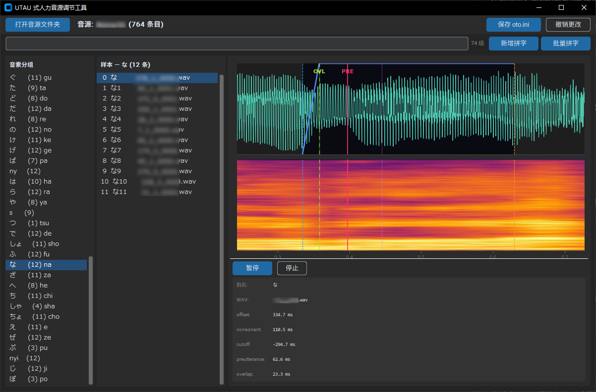

# UTAU 式人力音源调节工具（配合人力V助手使用）

> UTAU-jrkhh ((Jinriki Helper) Helper)

基于 `customtkinter` + `matplotlib` 的桌面 GUI 工具，用于可视化管理和排序 UTAU 音源的 `oto.ini` 条目优先级。

## 功能

- **可视化波形显示** — 双 subplot 同时展示波形与频谱，支持缩放/平移
- **拖拽排序** — 在分组内拖拽条目调整优先级，自动重编号
- **分组管理** — 右键菜单支持分组改名、合并
- **新增拼字** — 从辅音+元音来源样本组合生成新音素（crossfade 拼接）
- **批量拼字** — 基于完整音素表检测缺失项，一键批量生成
- **实时搜索** — 平假名/罗马音模糊匹配，快速定位分组
- **音频预览** — 点击条目即时播放对应 wav 片段
- **全局快捷键** — 键盘操作波形缩放/标记设置/分组切换，无需鼠标
- **Shift_JIS 兼容** — 自动检测 oto.ini 编码，正确处理日语音源文件

## 安装

```bash
git clone https://github.com/TNOTawa/utau-jrkhh.git
cd utau-jrkhh
pip install -r requirements.txt
```

## 运行

```bash
python main.py
```

启动后点击「打开音源文件夹」选择包含 `oto.ini` 的音源目录。

## 截图

<p align="center">
  
</p>

## 快捷键

| 按键 | 功能 |
|------|------|
| `Q` / `E` | 上一个/下一个分组 |
| `W` / `S` | 波形放大/缩小 |
| `A` / `D` | 波形左移/右移 |
| `1`~`5` | 设置 offset / overlap / preutterance / consonant / cutoff 到鼠标位置 |
| `Space` | 播放/暂停当前样本 |
| `↑` / `↓` | 组内上移/下移条目 |
| `Delete` | 停止播放 |
| `Ctrl+滚轮` | 缩放波形 |

此外，滚轮在很多地方都有妙用。

> 快捷键在输入框焦点下不触发，避免干扰文字输入。

## 依赖

- Python 3.8+
- customtkinter ≥ 5.2.0
- matplotlib ≥ 3.7.0
- sounddevice ≥ 0.5.0
- soundfile ≥ 0.12.0
- numpy ≥ 1.24.0
- scipy

## 项目结构

```
main.py                  — 入口
src/
  gui.py                 — 主界面
  oto_parser.py          — oto.ini 读写、分组、编码检测
  audio_player.py        — 音频播放（独立线程）
  waveform_display.py    — 波形+频谱渲染
  draggable_list.py      — 拖拽排序列表组件
  phoneme_combine_dialog.py   — 新增拼字对话框
  batch_combine_dialog.py     — 批量拼字对话框
  phoneme_group_dialog.py     — 分组改名/合并对话框
  perf_trace.py          — 性能追踪（默认禁用）
list.txt                 — 日语完整音素表（119 个，来自 oremo 的自带录音表）
```

## 许可

[MIT](LICENSE)
